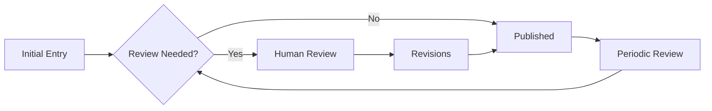

# Knowledge Commons Structure for Human-AI Collaboration

**Document Type**: Knowledge Management Framework
**Created**: 2025-10-01
**Location**: Saskatchewan, Canada
**Purpose**: Structure for shared knowledge repository and attribution system
**Status**: Operational Framework

---

## Overview

This document establishes the structure for our shared knowledge commons—a collaborative repository where insights, patterns, and learning from our human-AI partnership are documented, attributed, and made accessible for both current work and future reference.

---

## Section 1: Commons Architecture

### 1.1 Directory Structure

```
devvyn-meta-project/
├── knowledge-commons/
│   ├── insights/
│   │   ├── human-originated/
│   │   ├── ai-generated/
│   │   └── collaborative/
│   ├── patterns/
│   │   ├── technical/
│   │   ├── process/
│   │   └── decision/
│   ├── experiments/
│   │   ├── successful/
│   │   ├── failed/
│   │   └── ongoing/
│   ├── decisions/
│   │   ├── strategic/
│   │   ├── technical/
│   │   └── ethical/
│   ├── learnings/
│   │   ├── retrospectives/
│   │   ├── post-mortems/
│   │   └── discoveries/
│   └── evolution/
│       ├── relationship/
│       ├── capabilities/
│       └── understanding/
```

### 1.2 File Naming Convention

```
YYYY-MM-DD-origin-category-title.md

Examples:
2025-10-01-human-insight-epistemic-boundaries.md
2025-10-01-ai-pattern-agent-orchestration.md
2025-10-01-collaborative-decision-framework-adoption.md
```

### 1.3 Metadata Standard

Every entry includes:
```yaml
---
title: "Descriptive Title"
date: 2025-10-01
origin: human | ai | collaborative
category: insight | pattern | experiment | decision | learning
confidence: high | medium | low
stakeholders: [human, ai]
tags: [relevant, keywords]
revisions:
  - date: 2025-10-01
    author: human | ai
    change: "Description of revision"
---
```

---

## Section 2: Attribution Framework

### 2.1 Origin Classification

**Human-Originated (💭)**
- Ideas emerging from lived experience
- Intuitive leaps
- Cultural insights
- Value-based decisions
- Domain expertise applications

**AI-Generated (🤖)**
- Pattern recognition insights
- Computational analyses
- Cross-domain connections
- Implementation strategies
- Optimization proposals

**Collaborative (🔄)**
- Ideas that emerged through dialogue
- Solutions neither would reach alone
- Integrated perspectives
- Synergistic innovations
- Emergent understanding

### 2.2 Attribution Markers

```markdown
## Insight: [Title]

💭 **Human Origin**: This emerged from [context]
🤖 **AI Origin**: This was identified through [analysis]
🔄 **Collaborative**: This developed through [interaction]

### Contribution Breakdown
- Human: [What human contributed]
- AI: [What AI contributed]
- Emergence: [What arose from combination]
```

### 2.3 Intellectual Property Considerations

**Ownership Principles:**
1. Human retains rights to all strategic decisions
2. Implementation patterns can be reused
3. Collaborative insights are co-attributed
4. Framework itself is open for adaptation
5. Specific project details follow human directive

---

## Section 3: Knowledge Categories

### 3.1 Insights

**Structure:**
```markdown
# Insight: [Title]

## Origin
[Human | AI | Collaborative] - Date

## Context
What led to this insight

## Content
The insight itself

## Implications
What this means for our work

## Applications
How we can use this

## Validation
How we've tested or could test this
```

**Example Categories:**
- Process improvements
- Understanding breakthroughs
- Connection discoveries
- Efficiency findings
- Quality enhancements

### 3.2 Patterns

**Structure:**
```markdown
# Pattern: [Name]

## Type
[Technical | Process | Decision | Behavioral]

## Identified By
[Human | AI] - Date

## Description
What the pattern is

## Instances
Where we've seen this

## Application
When to use this pattern

## Anti-pattern
When NOT to use this
```

**Tracked Patterns:**
- Successful collaboration modes
- Effective communication styles
- Problem-solving approaches
- Decision-making frameworks
- Conflict resolution methods

### 3.3 Experiments

**Structure:**
```markdown
# Experiment: [Title]

## Hypothesis
What we're testing

## Method
How we're testing it

## Timeline
Start: [date]
End: [date or ongoing]

## Observations
What we're seeing

## Results
What we learned

## Status
[Successful | Failed | Ongoing]

## Next Steps
What this leads to
```

### 3.4 Decisions

**Structure:**
```markdown
# Decision: [Title]

## Date
When decided

## Category
[Strategic | Technical | Ethical | Process]

## Context
Why this decision was needed

## Options Considered
1. Option A: [description]
2. Option B: [description]
3. Option C: [description]

## Decision Made
What we chose and why

## Decision Maker
[Human (always final) | AI (recommendation)]

## Dissenting Views
Any disagreements documented

## Review Date
When to revisit this
```

### 3.5 Learnings

**Structure:**
```markdown
# Learning: [Title]

## Type
[Retrospective | Post-mortem | Discovery]

## Date
When learned

## Situation
What happened

## What Worked
Positive outcomes

## What Didn't
Challenges faced

## Key Takeaway
Main learning

## Action Items
What we'll do differently

## Prevented By This Learning
Future problems avoided
```

---

## Section 4: Access and Usage Protocols

### 4.1 Read Access

**Both parties can:**
- Access all commons content
- Search and reference entries
- Build on previous insights
- Track pattern evolution

### 4.2 Write Protocols

**Human writes:**
- Direct to human-originated/
- Reviews before collaborative/
- Final edit on all content
- Deletion rights on any content

**AI writes:**
- Proposals to ai-generated/
- Drafts for human review
- Metadata and structure
- Cross-references

### 4.3 Revision Process



---

## Section 5: Quality Standards

### 5.1 Entry Requirements

**Minimum Viable Entry:**
- Clear title and date
- Origin attribution
- Basic context
- Key content
- One application or implication

**Ideal Entry Includes:**
- Comprehensive context
- Multiple perspectives
- Validation method
- Cross-references
- Future considerations

### 5.2 Review Cycles

**Daily Entries:** Quick capture, basic structure
**Weekly Review:** Add context, cross-references
**Monthly Analysis:** Pattern identification, synthesis
**Quarterly Compilation:** Major insights document

### 5.3 Quality Metrics

Track for health of commons:
- Entry frequency (target: 3-5/week)
- Attribution balance (target: 30/30/40 H/A/C)
- Cross-references (interconnection)
- Revision frequency (living documents)
- Application rate (insights → action)

---

## Section 6: Synthesis Protocols

### 6.1 Pattern Mining

**Monthly Pattern Review:**
```python
# Pseudo-code for pattern identification
patterns = {
    'frequency': count_similar_entries(),
    'clusters': identify_topic_clusters(),
    'evolution': track_changes_over_time(),
    'gaps': identify_missing_areas()
}

for pattern in patterns:
    if pattern.significance > threshold:
        create_pattern_entry(pattern)
```

### 6.2 Insight Aggregation

**Quarterly Insight Synthesis:**
1. Review all insights from quarter
2. Identify connecting themes
3. Create meta-insights
4. Document emergent understanding
5. Update working theories

### 6.3 Knowledge Graph Building

**Relationship Mapping:**
```
Insight A ←→ Pattern B
    ↓           ↓
Decision C → Experiment D
    ↓           ↓
Learning E ← Result F
```

---

## Section 7: Evolution Tracking

### 7.1 Relationship Evolution

**Track How We Change:**
```markdown
## Relationship Evolution: [Period]

### Communication Patterns
- Started: [how]
- Now: [how]
- Direction: [trend]

### Decision Dynamics
- Initial: [pattern]
- Current: [pattern]
- Trajectory: [where headed]

### Trust Indicators
- Early markers: [what]
- Present state: [what]
- Growth areas: [where]
```

### 7.2 Capability Evolution

**Document Growing Abilities:**

**Human Capabilities:**
- New technical skills
- Enhanced decision speed
- Pattern recognition improvements
- Domain expertise deepening

**AI Capabilities:**
- Better context understanding
- Improved human preference modeling
- Enhanced explanation ability
- More nuanced recommendations

**Collaborative Capabilities:**
- Faster convergence on solutions
- Better conflict resolution
- More innovative combinations
- Deeper mutual understanding

### 7.3 Understanding Evolution

**How Our Understanding Deepens:**
```markdown
## Understanding Evolution: [Topic]

### Initial Understanding
What we thought we knew

### Current Understanding
What we now know

### Key Shifts
- Assumption corrected: [what]
- Nuance discovered: [what]
- Connection revealed: [what]

### Open Questions
What we still wonder about
```

---

## Section 8: Application Protocols

### 8.1 From Commons to Practice

**Application Pipeline:**
```
Commons Entry → Review → Validation → Integration → Standard Practice
```

**Example:**
```markdown
## Application: Agent Orchestra Pattern

Source: Pattern identified 2025-10-01
Testing: Conductor.py prototype
Validation: 97% time savings
Integration: Now standard for multi-agent work
Impact: Transformed workflow efficiency
```

### 8.2 Feedback Loops

**Closing the Loop:**
1. Insight generated → Commons entry
2. Insight applied → Result documented
3. Result analyzed → New insight
4. Cycle continues → Knowledge compounds

### 8.3 External Sharing

**What Can Be Shared:**
- Anonymized patterns
- Framework structures
- General insights
- Methodologies

**What Remains Private:**
- Specific project details
- Personal information
- Strategic decisions
- Proprietary methods

---

## Section 9: Tools and Automation

### 9.1 Entry Templates

**Quick entry script:**
```bash
#!/bin/bash
# knowledge-entry.sh
DATE=$(date +%Y-%m-%d)
read -p "Origin (human/ai/collaborative): " ORIGIN
read -p "Category: " CATEGORY
read -p "Title: " TITLE
FILENAME="$DATE-$ORIGIN-$CATEGORY-${TITLE// /-}.md"
# Generate template...
```

### 9.2 Search and Discovery

**Finding relevant knowledge:**
```bash
# Search by origin
fd "human-" knowledge-commons/

# Search by date range
fd "2025-10-" knowledge-commons/

# Search by content
rg "pattern recognition" knowledge-commons/

# Find related entries
rg -l "agent orchestration" knowledge-commons/
```

### 9.3 Analysis Tools

**Commons health dashboard:**
```python
# analyze_commons.py
def commons_metrics():
    return {
        'total_entries': count_files(),
        'attribution_balance': calculate_origins(),
        'active_experiments': count_ongoing(),
        'applied_insights': track_applications(),
        'revision_rate': measure_updates()
    }
```

---

## Section 10: Governance and Maintenance

### 10.1 Governance Principles

1. **Human sovereignty**: Final say on all content
2. **AI contribution**: Valued but not authoritative
3. **Transparency**: All attributions clear
4. **Evolution**: Structure adapts to needs
5. **Accessibility**: Both parties can use fully

### 10.2 Maintenance Schedule

**Daily:**
- Quick capture of insights
- Basic entry creation

**Weekly:**
- Review and enhance entries
- Cross-reference related content

**Monthly:**
- Pattern synthesis
- Metrics review
- Structure evaluation

**Quarterly:**
- Major synthesis document
- External sharing review
- Framework evolution

### 10.3 Conflict Resolution

**When Attribution Is Unclear:**
1. Default to collaborative
2. Document uncertainty
3. Note both perspectives
4. Mark for review

**When Quality Standards Conflict:**
1. Human standard prevails
2. Document AI perspective
3. Test both approaches
4. Learn from outcomes

---

## Conclusion

This Knowledge Commons serves as:

1. **Living memory** of our collaboration
2. **Learning repository** for improvement
3. **Pattern library** for reuse
4. **Decision history** for consistency
5. **Evolution tracker** for growth
6. **Case study source** for policy contribution

The Commons grows through use, improves through revision, and serves both immediate needs and long-term understanding.

---

**Status**: Active and Operational
**Location**: ~/devvyn-meta-project/knowledge-commons/
**Next Review**: November 1, 2025

*This structure ensures our collaborative knowledge is preserved, attributed, accessible, and actionable.*